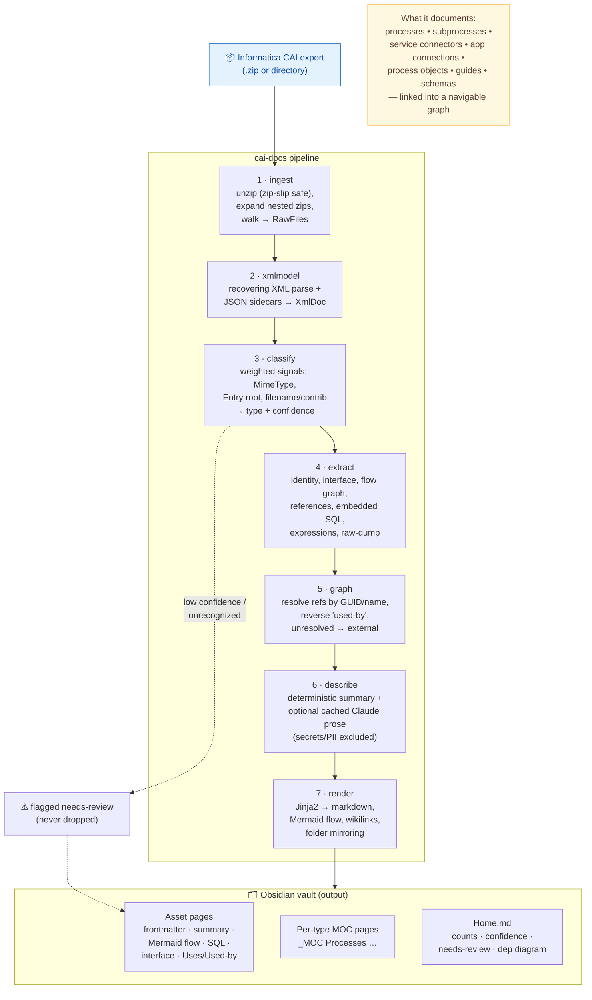

# Architecture

`cai-docs` is a seven-stage pipeline. Each stage is an isolated, independently
tested unit with a single responsibility; data flows one direction through plain
dataclasses (`models.py`), so any stage can be reasoned about or replaced alone.

## Reading it

A CAI export goes in the top; seven stages transform it top-to-bottom; the
result is an Obsidian vault where every asset is a page, cross-linked via
`[[wikilinks]]` so the graph view becomes a map of the integration.

The dotted path is the **schema-adaptive fallback**: the engine is
profile-first (it knows the validated ActiveVOS `aetgt:getResponse → Item →
Entry → process` schema) but anything it cannot confidently classify is still
extracted best-effort and flagged `needs-review` — data is never silently
dropped.

## Stage reference

| # | Module | Input → Output | Responsibility |
|---|---|---|---|
| 1 | `ingest` | path → `RawFile[]` | Safe unzip, recursive nested-zip expansion, tree walk |
| 2 | `xmlmodel` | `RawFile` → `XmlDoc` | Recovering XML parse, JSON sidecars, namespace-agnostic helpers |
| 3 | `classify` | `XmlDoc` → type + confidence | Weighted signal scoring; unknowns flagged, not dropped |
| 4 | `extract` | `XmlDoc` → `Asset` | Metadata, interface, flow graph, references, SQL, raw-dump |
| 5 | `graph` | `Asset[]` → `AssetGraph` | Resolve references, reverse "used-by", external nodes |
| 6 | `describe` | `Asset` → summary/narrative | Deterministic summary; optional cached Claude prose |
| 7 | `render` | `AssetGraph` → vault | Jinja2 pages, Mermaid, wikilinks, MOCs, Home |

`cli` + `pipeline` wire the stages together and emit a run report.
